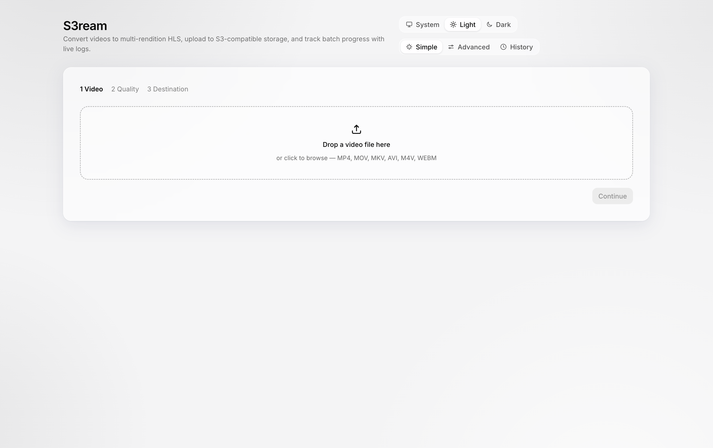
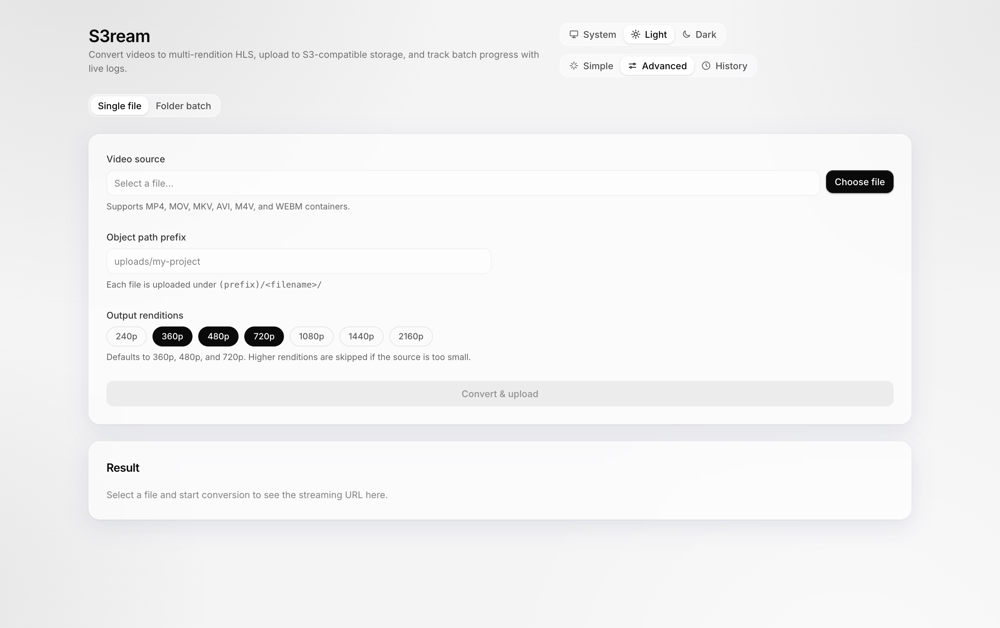
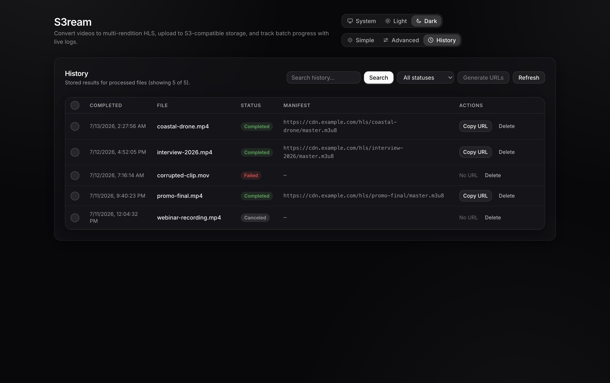

# S3ream

[](https://github.com/Gr3gg0r/S3ream/actions/workflows/ci.yml)
[](LICENSE)

Electron desktop app that converts MP4 (or any FFmpeg-compatible video) into a multi-bitrate HLS stream locally and uploads the result straight to an S3-compatible object store — no transcoding server, no third-party service in between. Everything is configured in the app; a local RustFS Docker stack is included for development.



<details>
<summary>More screenshots</summary>





</details>

## Why this exists

Running a server just to convert video to HLS is an unnecessary burden — your desktop is already powerful enough. This app does the whole job locally: it converts video into a proper multi-bitrate HLS stream (adaptive master manifest plus renditions, ready for real streaming players) and uploads the assets straight to whatever S3-compatible storage you choose. No transcoding backend to run, no service to pay, no middleman holding your files.

## Prerequisites

- [pnpm](https://pnpm.io/) ≥ 8
- Node.js ^20.19.0 or ≥ 22.12.0
- Docker & Docker Compose (for the bundled RustFS stack)
- FFmpeg (optional locally; the app ships with a bundled binary)

The repo also pins its toolchain with [proto](https://moonrepo.dev/proto) (`.prototools`: Node 22.23.1, pnpm 8.15.4). If you use proto, `proto install` in the repo root gives you the exact versions; otherwise just match the versions above.

## Getting Started

```bash
pnpm install
pnpm run dev
```

The `dev` command starts the Electron main process, Vite dev server for the renderer, and watches the preload bundle.

### Building for Production

```bash
pnpm run build
pnpm run preview
```

## Configuration

Everything is configured in the app — there are no env files to set up. In the **Simple** journey, the destination step collects your S3 connection details (endpoint, region, bucket, credentials, path-style, public/view base URLs, and upload concurrency) and saves them locally on your machine. Secrets are encrypted with your OS keychain when available; nothing leaves the app except uploads to the endpoint you configure.

By default, uploads make the target bucket **publicly readable** so the generated streams play without signed URLs — the destination step discloses this and lets you turn it off (objects then stay private and you'll need signed URLs or your own bucket policy to play them).

For development, the `dev:*` scripts can preload settings from env presets (e.g. `pnpm run dev:slow` loads `.env.slow` for the Toxiproxy endpoint). Saved UI settings always take precedence over env vars.

| Variable                     | Description                                                                          |
| ---------------------------- | ------------------------------------------------------------------------------------ |
| `S3_REGION`                  | Region for the bucket (e.g. `us-east-1`)                                             |
| `S3_ACCESS_KEY_ID`           | Access key for the S3-compatible endpoint                                            |
| `S3_SECRET_ACCESS_KEY`       | Secret key for the S3-compatible endpoint                                            |
| `S3_BUCKET_NAME`             | Target bucket for uploads                                                            |
| `S3_ENDPOINT_URL`            | Base URL for the S3-compatible API (e.g. `https://s3.example.com`)                   |
| `S3_USE_PATH_STYLE_ENDPOINT` | `true` to force path-style requests (required for self-hosted stores like RustFS)    |
| `S3_BUCKET_URL`              | Bucket URL used when constructing public links (e.g. `https://s3.example.com/media`) |
| `S3_VIEW_ENDPOINT`           | Optional fully-qualified base (such as a CDN) for viewing uploaded objects           |
| `S3_UPLOAD_CONCURRENCY`      | Parallel upload workers (default 4, max 16)                                          |

## Local S3 via Docker (RustFS)

The included `docker-compose.yml` spins up a [RustFS](https://rustfs.com) server with persistent storage — an Apache-2.0, S3-compatible object store used as the local testing backend. (MinIO was dropped after it gutted its community console.)

```bash
docker compose up -d
```

The instance exposes:

- S3-compatible API on `http://localhost:9000`
- Console UI on `http://localhost:9001`

Credentials default to `rustfsadmin:rustfsadmin` — enter them in the app's destination step (or change them in `docker-compose.yml` if needed). An optional Toxiproxy sidecar adds a latency/bandwidth-limited S3 endpoint on `http://localhost:8666` for slow-network testing (`pnpm run dev:slow`).

## UI & Theming

- Renderer built with React + Vite + TypeScript, styled with Tailwind CSS + DaisyUI
- Monochrome black-and-white design (light theme: black on white; dark theme: inverted) with frosted-glass panels over a subtle gradient canvas — only status badges carry color
- Header theme toggle: **System** / **Light** / **Dark** (System tracks the OS preference live)
- Three views behind a segmented switch: **Simple** (guided journey), **Advanced** (single file or folder batch with full queue controls), and **History** (search, filter, copy manifest URLs, delete)

## The Conversion Journey

The **Simple** view walks through three steps:

1. **Video** — drop a file onto the drop zone (or click to browse). MP4, MOV, MKV, AVI, M4V, and WEBM are accepted.
2. **Quality** — pick the output renditions (240p through 4K; defaults to 360p/480p/720p). Renditions taller than the source are skipped automatically.
3. **Destination** — choose a **local folder** (the HLS tree is written under `<folder>/<key>/`) or **S3 storage** (endpoint, bucket, region, keys — see "Settings & Secrets" below).

Electron's main process then converts the video to multi-bitrate HLS (adaptive master manifest + renditions) with the bundled FFmpeg toolchain and either copies the tree to the chosen folder or uploads it to the bucket. The result screen shows the manifest URL (or local manifest path) with one-click copy.

The **Advanced** view exposes the original single-file and folder-batch modes with queue controls (pause/resume/cancel, concurrency 1–16) and deduplication against the history store. Cancelling a running job aborts the FFmpeg process and any in-flight uploads immediately; objects already uploaded are left in place (re-running the same file and prefix overwrites them).

All long-running work runs outside the renderer via IPC bridges exposed through the preload script.

## Settings & Secrets

S3 connection settings can be entered directly in the app (Simple → Destination → S3 storage). They are stored locally in `settings.json` inside the app's user-data directory:

- Secrets are encrypted at rest with the OS keychain via Electron's `safeStorage` when available; on systems without a keychain the values are stored in plaintext and the UI says so explicitly. Everything stays on your machine — nothing is sent anywhere except your chosen S3 endpoint.
- Saved settings take precedence over `.env` values for any non-empty field; `.env` remains the bootstrap/fallback. The Advanced batch mode uses saved settings, or `.env` when none are saved.
- Leaving the access key or secret field blank keeps the previously stored value.
- The renderer only ever sees masked flags (`hasAccessKey` / `hasSecretKey`) — raw secrets never cross the IPC bridge.

## Project Structure

```
.
├── docker-compose.yml
├── electron.vite.config.ts
├── src
│   ├── main          # Electron main process code & backend services
│   ├── preload       # Secure bridge between renderer and main
│   └── renderer      # React + Vite front-end
├── tailwind.config.cjs
└── tsconfig*.json
```

## Testing

The project uses [Vitest](https://vitest.dev) with two tiers:

```bash
pnpm run test             # Unit + renderer tests (fast, no external services)
pnpm run test:watch       # Watch mode
pnpm run test:integration # Everything, incl. FFmpeg + live RustFS round trips
```

Integration tests need the local stack running:

```bash
docker compose up -d
pnpm run test:integration
```

If ports 9000/9001 are busy, run the stack on alternates and point the tests at it:

```bash
RUSTFS_API_PORT=9002 RUSTFS_CONSOLE_PORT=9003 docker compose up -d
S3_TEST_ENDPOINT_URL=http://localhost:9002 pnpm run test:integration
```

What the suites cover:

- **Pure pipeline helpers** — rendition selection, bitrate/dimension math, frame-rate parsing, master-manifest generation (`tests/main/videoPipeline.test.ts`)
- **S3 client configuration** — endpoint parsing, boolean env handling, public-URL building, credential validation, saved-settings overrides (`tests/main/minioClient.test.ts`)
- **Queue orchestration** — enqueue/dedup/skip rules, concurrency clamping, cancel-via-AbortController, clear-completed (`tests/main/jobManager.test.ts`)
- **History persistence** — upsert/merge, search & pagination, 2000-job and 5000-log caps, corrupt-file recovery, restart sweep (`tests/main/historyService.test.ts`)
- **Settings persistence** — save/load round-trip, secret masking, keep-secret-on-empty, corrupt-file recovery, OS-encryption and plaintext fallback paths (`tests/main/settingsService.test.ts`)
- **Renderer smoke** — app shell, mode switching, history view, clipboard copy (`tests/renderer/App.test.tsx`, jsdom)
- **Real FFmpeg** — metadata probe, HLS conversion, temp-dir leak regression (`tests/integration/ffmpeg.integration.test.ts`)
- **Real S3 round trip** — bucket creation, public-read policy, anonymous fetch (`tests/integration/s3.integration.test.ts`)
- **End-to-end pipeline** — convert → upload → fetch manifest back from RustFS (`tests/integration/pipeline.integration.test.ts`)
- **Local-folder output** — convert → copy HLS tree to a local directory, asserting no S3 is involved (`tests/integration/localOutput.integration.test.ts`)

The `electron` module is aliased to `tests/mocks/electron.ts` in unit tests, so main-process services run in plain Node. Each test file gets an isolated Electron `userData` directory via `tests/setup.ts`.

## Recommended Commands

- `pnpm run lint` — ESLint over TypeScript sources
- `pnpm run format` — Format with Prettier (renderer + shared configs)
- `pnpm run test` — Unit + renderer tests
- `pnpm run test:integration` — Full suite against the Docker stack

## Contributing

Issues and pull requests are welcome — see [CONTRIBUTING.md](CONTRIBUTING.md). Please report security issues privately per [SECURITY.md](SECURITY.md).

## License

[MIT](LICENSE) © 2025 Shahfiq Shah. Third-party attributions, including the GPL-3.0 notice for the bundled FFmpeg binaries, live in [NOTICE](NOTICE).
